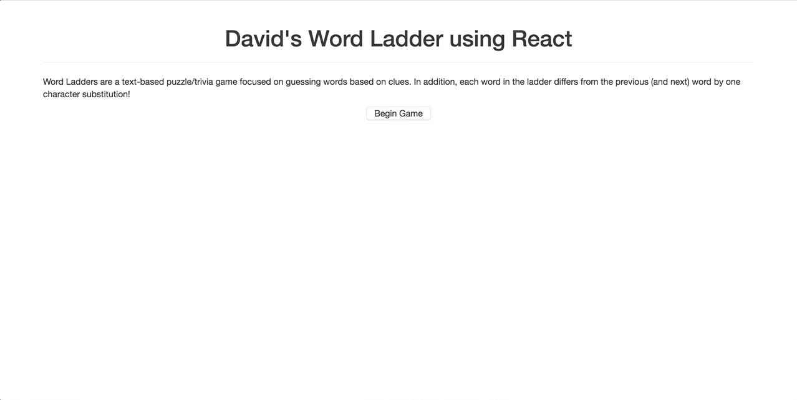

# Explore React Library

## Summary
I chose to explore the [React](https://facebook.github.io/react/) library for this project. It excels at making an interactive user interface by using a virtual DOM and reusable components. To demonstrate these concepts, I chose to make a Word Ladder game, where the user must guess words given a corresponding clue and the fact that it differs from the previous (and next) word by one letter substitution.

To make this project, I used the [official React tutorial](https://facebook.github.io/react/tutorial/tutorial.html), the [Todo MVC tutorial](http://todomvc.com/examples/react/#/), and [this tutorial](https://html5hive.org/react-tutorial/). The inspiration to do a Word Ladder came from [sporcle](www.sporcle.com).

React is worth exploring because it is a powerful framework used by major companies such as Facebook, but still allows you complete flexibility in the web stack you use since it is only the "view" layer. In addition, it provides the developer with an experience that is centered around javascript (+ css) rather than raw html. This also provides a safer environment, since JSX protects against XSS attacks and makes it easier to keep track of matching tags.

My page is built to show off React's ability to create modular components and cascade re-renders as appropriate. As the user inputs guesses, they interactively modify the internal state (which words they have guessed) which automatically caused the "rungs" to rerender as appropriate. The overall game component does not have to worry about how the ladder or the rungs render, as they handle that themselves. Lastly, the timer component displays how React allows the user to develop reusable, compartmentalized code that relies on callbacks to communicate. (Note: My page is not meant to show off perfect separation between internal logic and presentation, as that is typically done through an additional state container like Redux or Flux which would be too complex for this assignment)

See index.html in this folder for my showcase of the React library.

Name: David Maydew

NetID: dmm68

Started, Finished, Hours: Feb 23, Feb 25, 12 hours

Students talked to: None

Resources used: [official React tutorial](https://facebook.github.io/react/tutorial/tutorial.html), the [Todo MVC tutorial](http://todomvc.com/examples/react/#/), and [this tutorial](https://html5hive.org/react-tutorial/)

Assets used: None

Bugs: None
